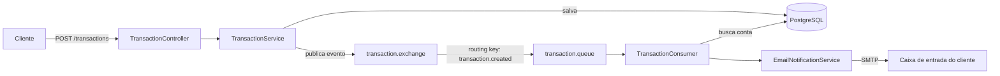

# NotifyBank

Uma API Spring Boot para monitoramento de transações bancárias com notificações por e-mail assíncronas e orientadas a eventos.

## Visão Geral

O NotifyBank expõe uma API REST para gerenciar contas bancárias e transações. Toda transação criada dispara um evento assíncrono via RabbitMQ, que é consumido para enviar uma notificação por e-mail ao titular da conta — desacoplando o caminho de escrita (requisição HTTP) do caminho de notificação (envio de e-mail).

## Arquitetura



## Stack Tecnológica

- **Java 21** / **Spring Boot 4.1.1**
- **Spring Data JPA** + **PostgreSQL** — persistência
- **Flyway** — migrations versionadas de banco de dados
- **Spring AMQP** / **RabbitMQ** — mensageria assíncrona orientada a eventos
- **Spring Mail** — envio de e-mail via SMTP
- **springdoc-openapi** — documentação interativa da API (Swagger UI)
- **Lombok** — redução de boilerplate
- **Docker Compose** — PostgreSQL e RabbitMQ locais

## Funcionalidades

- CRUD completo de contas bancárias e transações
- Notificações orientadas a eventos: toda transação publica um evento consumido de forma assíncrona para enviar um e-mail
- Validação de requisições com Bean Validation (`@NotNull`, `@Email`, `@Pattern`)
- Separação entre DTO e entidade, com records dedicados de request/response e camada de mapper
- Documentação interativa da API via Swagger UI

## Como Executar

### Pré-requisitos

- Java 21
- Docker e Docker Compose
- Uma conta Gmail com uma [Senha de App](https://myaccount.google.com/apppasswords) gerada (requer verificação em duas etapas ativada)

### 1. Clone o repositório

```bash
git clone https://github.com/fernvndomatos/NotifyBank.git
cd NotifyBank
```

### 2. Suba o PostgreSQL e o RabbitMQ

```bash
docker compose up -d
```

Isso inicia:
- PostgreSQL em `localhost:5432`
- RabbitMQ em `localhost:5672` (AMQP) e `localhost:15672` (interface de administração)

### 3. Configure as variáveis de ambiente

A aplicação espera as seguintes variáveis de ambiente (configure na sua IDE ou no shell):

```
DB_USERNAME=notifybank
DB_PASSWORD=notifybank123
RABBITMQ_USERNAME=notifybank
RABBITMQ_PASSWORD=notifybank123
MAIL_USERNAME=<seu-email-gmail>
MAIL_PASSWORD=<sua-senha-de-app-do-gmail>
```

### 4. Rode a aplicação

```bash
./mvnw spring-boot:run
```

O Flyway aplica as migrations automaticamente na inicialização. A API sobe em `http://localhost:8080`.

### 5. Explore a API

Swagger UI: [http://localhost:8080/swagger-ui.html](http://localhost:8080/swagger-ui.html)

## Endpoints da API

### Contas Bancárias

| Método | Endpoint | Descrição |
|--------|----------|-----------|
| POST | `/notifybank/account` | Cria uma conta bancária |
| GET | `/notifybank/account` | Lista todas as contas |
| GET | `/notifybank/account/{id}` | Busca conta por ID |
| PUT | `/notifybank/account/{id}` | Atualiza conta |
| DELETE | `/notifybank/account/{id}` | Remove conta |

### Transações

| Método | Endpoint | Descrição |
|--------|----------|-----------|
| POST | `/notifybank/transactions` | Cria uma transação (dispara notificação por e-mail) |
| GET | `/notifybank/transactions` | Lista todas as transações |
| GET | `/notifybank/transactions/{id}` | Busca transação por ID |
| GET | `/notifybank/transactions/account/{id}` | Lista transações de uma conta |
| DELETE | `/notifybank/transactions/{id}` | Remove transação |

## Estrutura do Projeto

```
src/main/java/com/github/fernvndomatos/NotifyBank/
├── config/          # Configuração do RabbitMQ e OpenAPI
├── controller/      # Controllers REST
├── dto/             # Records de request/response
├── entity/          # Entidades JPA
├── enums/           # Enums de domínio
├── exception/       # Exceções customizadas
├── mapper/          # Conversão entre entidade e DTO
├── messaging/        # Producer, consumer e serviço de notificação por e-mail
├── repository/      # Repositories do Spring Data JPA
└── service/         # Lógica de negócio
